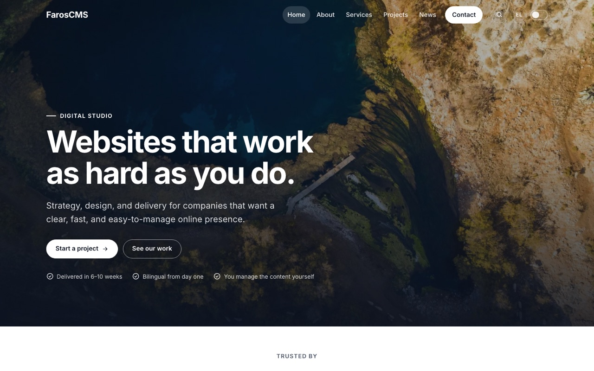
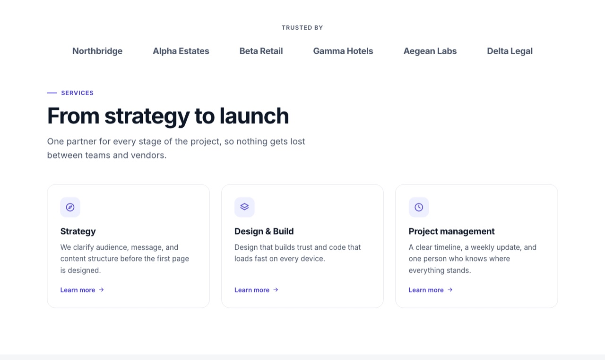
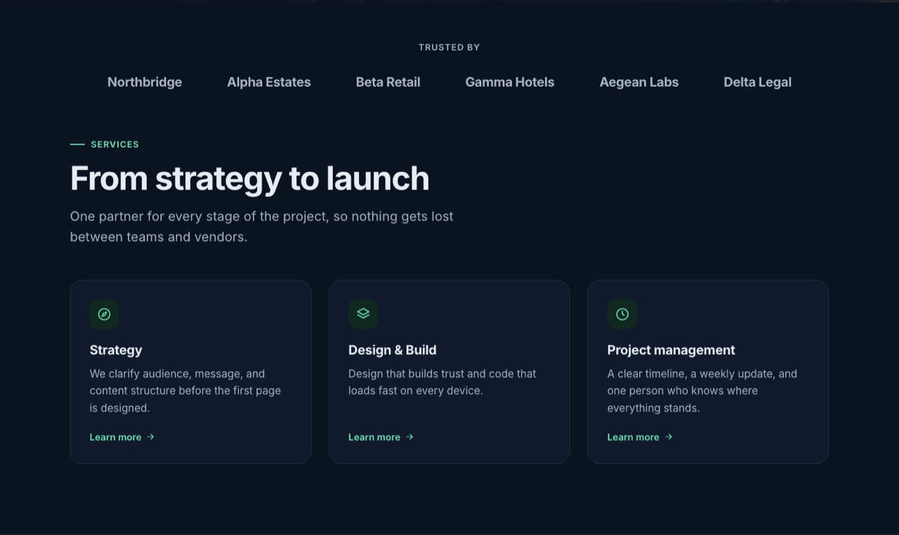
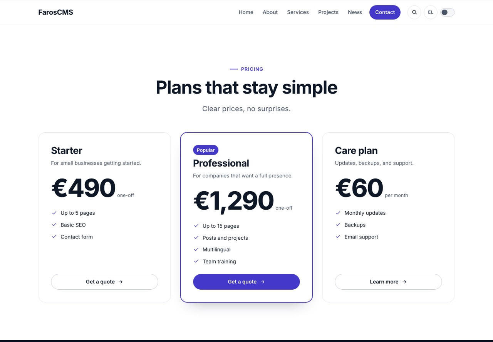
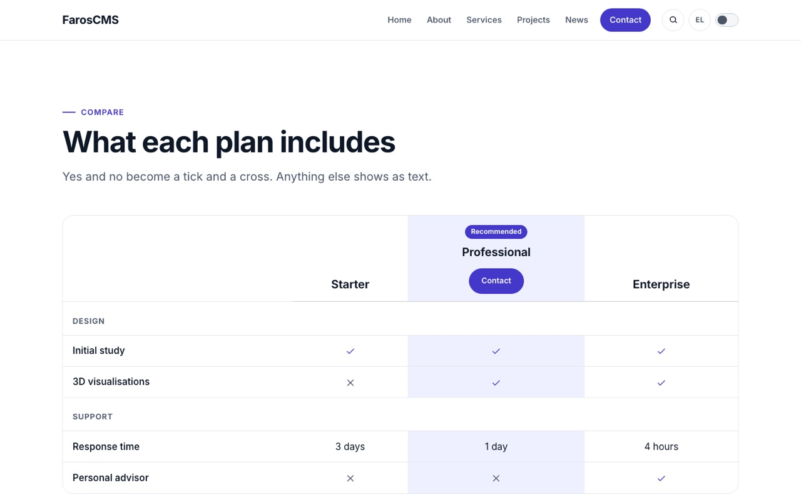
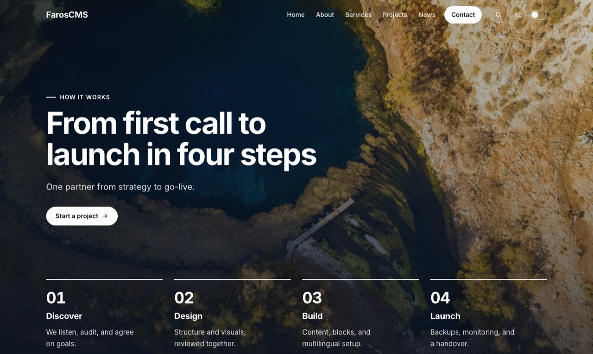

<div align="center">

# FarosCMS

**A flat-file CMS for websites that look great and stay easy to run.**

Markdown and YAML content · Twig themes with a block editor · multilingual · no database server

[](https://github.com/chiotis/faroscms/releases)
[](#requirements)
[](LICENSE)
[](https://github.com/chiotis/faroscms/actions/workflows/tests.yml)
[](#requirements)

<br>



</div>

<br>

FarosCMS keeps your pages, posts and projects as plain **Markdown files with YAML front matter**, renders them with **Twig**, and gives the people who edit the site a clean **admin with a block editor**. Settings, users and history live in a single SQLite file, so there is no database to install and nothing to configure before the first page loads. Copy the folder to any PHP host and it runs.

It is built for the kind of site an agency or freelancer hands to a client: a good-looking business website, in more than one language, that the client can change without breaking.

## Why FarosCMS

| | |
|---|---|
| **Your content is just files** | Pages, posts, projects, menus and forms are Markdown/YAML in `content/`. Read them, diff them, keep them in Git, back them up with `cp`. |
| **A design system, not a blank theme** | One all-purpose `default` theme: 25 blocks with layout variants, 6 colour palettes, light and dark mode, three corner styles, seven header layouts and five footer layouts, responsive images and WCAG-minded markup. |
| **A block editor that keeps the design consistent** | Pages are built from ready-made sections (hero, features, pricing, comparison table, before/after slider, FAQ, gallery, map, forms…). Editors change text, images and order; the layout stays sound. |
| **Multilingual from the start** | Each page can have a translation per language, with their own addresses, menus, labels and redirects. Greek is transliterated to clean Latin addresses out of the box. |
| **SEO in one place** | A Manage > SEO screen: checks of the site and of every entry, title formats, descriptions, share cards, robots.txt and the sitemap, structured data for an organization, a business or a person, and ownership codes, each with a live preview. See [docs/seo.md](docs/seo.md). |
| **Safe to hand over** | Roles and permissions (with roles of your own), history with compare and restore, redirects when an address changes, links that follow, storage and upload limits, activity log. |
| **Quiet to run** | Scheduled backups (local and S3-compatible), one-click checks for updates, email through SMTP or Amazon SES, a system status screen. |
| **Yours to change** | Everything site-specific lives in `custom/`, which updates never touch: CSS, JS, templates, blocks, icons, strings. |

## A look

<table>
  <tr>
    <td width="50%"></td>
    <td width="50%"></td>
  </tr>
  <tr>
    <td align="center"><sub>Light mode, indigo palette</sub></td>
    <td align="center"><sub>Dark mode, emerald palette</sub></td>
  </tr>
  <tr>
    <td width="50%"></td>
    <td width="50%"></td>
  </tr>
  <tr>
    <td align="center"><sub>Pricing block</sub></td>
    <td align="center"><sub>Comparison table block</sub></td>
  </tr>
</table>

<p align="center"><br><sub>Hero with numbered steps, one of five hero layouts</sub></p>

## Quick start

```bash
git clone https://github.com/chiotis/faroscms.git
cd faroscms
php scripts/use-starter.php        # copies the demo site from starter/ into content/ and public/uploads/
# A site that already has content can add what it lacks of the demo in Admin > System > Demo content (nothing is replaced).
php scripts/import-wordpress.php https://example.com   # what moving a WordPress site over would do (add --apply; see docs/wordpress-import.md)
php -S 127.0.0.1:8087 -t public public/index.php
```

Open <http://127.0.0.1:8087/> for the demo site and <http://127.0.0.1:8087/admin/login> for the admin. A site with no accounts asks for its first administrator on that page: pick your own username and password. There is no default account.

The repository holds code only: a site's pages, posts, media, uploads, custom files and database are never part of it, so updates cannot touch them. That is also what makes **Admin → Updates → Install** safe. See [update.md](update.md) for putting a site on a server and for updating it.

That is the whole setup. The repository includes its PHP dependencies (`vendor/`) and the compiled admin CSS, so a server needs neither Composer nor Node.js.

### Requirements

- PHP **8.1 or newer** with `pdo_sqlite` and `mbstring`
- The `gd` extension (with WebP) if you want responsive WebP image variants generated on demand; `exif` for photo orientation
- A web server that points its document root at `public/`: Apache works with the shipped `.htaccess`; nginx needs one `try_files` line (see [docs/theming.md](docs/theming.md#server-configuration))

## How it fits together

```text
content/        pages, posts, projects, menus, forms, taxonomies (Markdown + YAML)
custom/         this site's own CSS, JS, templates, blocks, icons, strings; never touched by updates
themes/default/ the theme: blocks, templates, components, icons, translations, theme.yaml
storage/        the SQLite system database and backups
public/         the only folder the web server needs to see
src/, admin/    the application and the admin interface
```

A page is a Markdown file. Its front matter can hold a list of blocks:

```markdown
---
title: How it works
status: published
translation_id: 4f1c9a2b7d3e8a10
blocks:
  - type: hero
    variant: steps
    heading: From first call to launch in four steps
    text: One partner from strategy to go-live.
    items:
      - title: Discover
        text: We listen, audit, and agree on goals.
      - title: Design
        text: Structure and visuals, reviewed together.
  - type: pricing
    heading: Plans that stay simple
---

Anything written here is the page's Markdown body.
```

Editors never have to see that: the admin's block editor writes it for them, with a form for every block, live add/remove/reorder, and ready-made sections to start from.

### The theme

The `default` theme is one design system that grows by adding blocks and variants rather than by forking:

- **25 blocks:** hero (split, centered, cover, steps, minimal), features, cards, text and image, stats, logos, testimonials, team, timeline, pricing, comparison table, before/after slider, tabs, FAQ, gallery (grid, masonry, strip), video with a viewer, slider, map, contact, forms, banner, call to action, and latest content in eight layouts.
- **Branding** in *Theme* in the admin, for a designer: your own colours for light and dark, fonts (or your own WOFF2 file), text size and heading scale, widths, spacing, header height, corner radius, buttons, logo sizes, a logo for dark backgrounds, favicon and share image, beside a live preview of the real site at computer, tablet and phone size.
- **Site options** in *Theme* in the admin: header and footer layouts, a transparent header over the opening hero, a bottom action bar for phones, five styles for the phone menu, a card for the single page and one for the list of every content type (page layout with or without a sidebar, title area, header, archive layout), social profiles.
- **Content types** with their own fields, archive layouts, filters and pagination, plus categories and tags with layouts of their own.
- **Accessible by default:** skip link, real landmarks and heading levels, keyboard-friendly menus and viewers, reduced motion, and a browser audit script (`scripts/theme-audit.js`) that runs axe-core against WCAG 2.2 AA.

Read [docs/theming.md](docs/theming.md) for the contract and [docs/theme-developer-guide.md](docs/theme-developer-guide.md) to build on it.

### The admin

A calm, fixed layout: content types and Media under **Content**, Forms, Menus (a two-panel editor: pick what the site has, drag it into place, set each link's labels in every language), Theme, Taxonomies, SEO, Redirects, Translations and History under **Manage**, and Users & Roles, Logs, Backups, Updates and Settings under **System**. Every screen with a form ends in one fixed Save bar that also carries messages. Settings are split into tabs, and choosing an icon anywhere opens one shared picker.

## Security

Sessions are `HttpOnly` and `SameSite`, every admin POST carries a CSRF token, sign-in is throttled, settings secrets are never rendered back, uploads are limited to inert file types (scripted SVGs are refused), and permissions are checked per screen with administrator-only as the default for anything new. Details, and a checklist for whoever runs the server, are in [docs/security.md](docs/security.md).

If you find a vulnerability, please open a private security advisory on GitHub rather than a public issue.

## Tests

The suite needs only PHP and Python 3 (standard library). HTTP tests run against a throw-away copy of the code with a small fixture site, so they never touch your content:

```bash
tests/run.sh          # everything: unit checks and browser-level HTTP tests
tests/run.sh unit     # the fast PHP checks
tests/run.sh blocks   # one HTTP test by name
```

GitHub Actions runs the same suite on PHP 8.1, 8.3 and 8.5 for every push to `main` and every pull request ([workflow](.github/workflows/tests.yml)).

See [tests/README.md](tests/README.md) for what is covered and what is not (real browsers and screen readers are checked by hand and with the audit script).

The admin CSS is a compiled Tailwind build. Only if you change Tailwind classes in `admin/templates/` or `public/assets/js/`, rebuild it:

```bash
npm install && npm run build:css
```

## Documentation

| | |
|---|---|
| [docs/architecture.md](docs/architecture.md) | Code map: request flow and what each class does |
| [docs/theming.md](docs/theming.md) | Theme contract, blocks, settings, assets, server configuration |
| [docs/theme-developer-guide.md](docs/theme-developer-guide.md) | Building blocks, templates and content types |
| [docs/security.md](docs/security.md) | Security model and operator checklist |
| [docs/admin-accessibility.md](docs/admin-accessibility.md) | What was checked in the admin, the rules the templates keep, how to check again |
| [docs/backups.md](docs/backups.md) | Local and remote backups, restore |
| [update.md](update.md), [docs/update-workflow.md](docs/update-workflow.md) | Putting a site on a server, installing updates from the admin, and how that stays safe |
| [docs/system-database.md](docs/system-database.md) | What lives in SQLite |
| [custom/README.md](custom/README.md) | How site-specific overrides work |
| [CHANGELOG.md](CHANGELOG.md), [ROADMAP.md](ROADMAP.md) | What changed and what is next |

## Status

FarosCMS is under active development and is **pre-1.0** (see [VERSION](VERSION) and the [releases](https://github.com/chiotis/faroscms/releases)). It runs real sites, and the content format (Markdown and YAML) is deliberately simple and stable, but the code is still moving quickly: read the [changelog](CHANGELOG.md) before updating and take a backup first. Issues and ideas are welcome.

## License

[MIT](LICENSE) © Christos Chiotis
